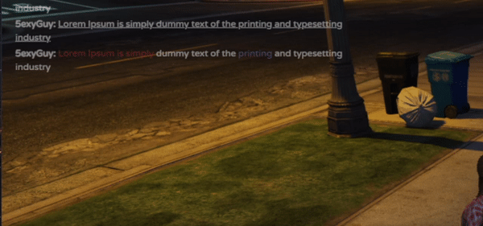

<br />
<div align="center">
  <h3 align="center">altV-vChat</h3>

  <p align="center">
    A chat resouce for alt:V server
  </p>
</div>

<!-- ABOUT -->

## About

[](https://www.youtube.com/watch?v=GM9chEZhLRY)

**altV-vChat** is a chat resource for [alt:V](https://altv.mp) server that offers more functionality than the example
resource. The resource includes full keyboard support, a default message processor, more functions, autocompletion of
command by typing part of the command name in the input field and more.

**Features:**

-   Keyboard and Mouse Support
-   Command Suggestions
-   Text Formatting
-   Emojis

It is also included in the project together with other examples of front-end framework implementations, if you want to
get some ideas for your own project.

**`WebView` examples:**

-   [x] [Svelte](https://github.com/5exyGuy/altv-vchat/tree/master/views/svelte)
-   [x] [React](https://github.com/5exyGuy/altv-vchat/tree/master/views/react)
-   [x] [Vue.js](https://github.com/5exyGuy/altv-vchat/tree/master/views/vue)
-   [x] [SolidJS](https://github.com/5exyGuy/altv-vchat/tree/master/views/solid)

<p align="right">(<a href="#top">back to top</a>)</p>

<!-- GETTING STARTED -->

## Getting Started

> **_NOTE:_** Before starting to use a chat resource make sure that _ESMAScript_ modules are enabled in your server
> project or else the resource won't start.

### Prerequisites (Optional)

[pnpm](https://pnpm.io/) is required if you want to make changes in the project because it uses
[Workspaces](https://pnpm.io/workspaces) to manage multiple packages. To make changes, follow the
[installation instructions](https://pnpm.io/installation) how to install `pnpm`.

### Installation

1. Download [the latest version](https://github.com/5exyGuy/altv-vchat/releases/tag/latest) of the resource **OR** clone
   the repository into your server's resources folder
    ```sh
    git clone https://github.com/5exyGuy/altv-vchat.git vchat
    ```
2. If you have cloned the repository, follow these steps

    2.1. Inside the resource's folder install required packages

    ```sh
    pnpm install
    ```

    2.2. Change to your preferred implementation of the front-end framework example by adding `filter` flag in the
    `package.json` **(optional)** or you can simply remove unwanted example folders in `views` directory.

    > **_NOTE:_** Make sure to remove the ones you don't need, because if you don't put the flags the right way, you may
    > end up with building multiple examples in one folder.

    ```json
    "build": "turbo run build --filter=!@altv-chat/react --filter=!@altv-chat/vue",
    "dev": "turbo run dev --filter=!@altv-chat/react --filter=!@altv-chat/vue"
    ```

    2.3. Build the project

    ```sh
    pnpm run build
    ```

3. Add the chat resource as a dependency in the `resource.toml` file inside your resource folder
    > **_NOTE:_** Make sure that the name you insert matches the name of the resource folder.
    ```
    deps = ['vchat']
    ```
    **OR** add it into `server.toml`
    ```
    resources = ['vchat']
    ```
4. Import the chat library in your server-side code
    > **_NOTE:_** Make sure that the name of the library you insert matches the name of the resource folder.
    ```js
    import * as chat from 'vchat';
    ```
    > **_NOTE:_** If you are using C#, it is recommended to see how to insert functions in the C# environment
    > ([Resource communication in C#](https://docs.altv.mp/cs/articles/getting-started/resource-communication.html)).
5. If you are using TypeScript, install types for `vchat` and include it in `tsconfig.json`
    ```sh
    pnpm install @altv-vchat/types -D
    ```
6. Start the server.

<p align="right">(<a href="#top">back to top</a>)</p>

<!-- USAGE EXAMPLES FOR PLAYER -->

## Usage

### 1. Keyboard and Mouse Support

Chat has keyboard support, which allows you to control the chat. Also, the input field is always in focus, so you can
make mouse clicks in any position. There is a prevention for the input field from losing it's focus.

| Key                                          | Description                                                                 |
| -------------------------------------------- | --------------------------------------------------------------------------- |
| <kbd>T</kbd>                                 | Opens the chat                                                              |
| <kbd>ESC</kbd>                               | Closes the chat                                                             |
| <kbd>PageUp</kbd></br><kbd>WheelUp</kbd>     | Scrolls up                                                                  |
| <kbd>PageDown</kbd></br><kbd>WheelDown</kbd> | Scrolls down                                                                |
| <kbd>Home</kbd>                              | Scrolls to the top (the oldest message)                                     |
| <kbd>End</kbd>                               | Scrolls to the end (the lastest message)                                    |
| <kbd>↑</kbd>                                 | Selects command suggestion **OR**</br> Selects a previously entered message |
| <kbd>↓</kbd>                                 | Selects command suggestion **OR**</br>Selects a previously entered message  |
| <kbd>Tab</kbd>                               | Finish typing the selected command suggestion                               |


> **_NOTE:_** Only right mouse button and mouse wheel is supported to avoid unnecessary actions.

### 2. Chat Formatting (Default Message Formatter)

To disable the default message formatter, set `enableDefaultMessageFormatter` to `false` in the `options.json` file.

#### Bold text

`**Lorem Ipsum is simply dummy text of the printing and typesetting industry**`

**Lorem Ipsum is simply dummy text of the printing and typesetting industry**


#### Italic text

`*Lorem Ipsum is simply dummy text of the printing and typesetting industry*`

_Lorem Ipsum is simply dummy text of the printing and typesetting industry_


#### Deleted text

`~~Lorem Ipsum is simply dummy text of the printing and typesetting industry~~`

~~Lorem Ipsum is simply dummy text of the printing and typesetting industry~~


#### Underlined text

`__Lorem Ipsum is simply dummy text of the printing and typesetting industry__`

<u>Lorem Ipsum is simply dummy text of the printing and typesetting industry</u>


#### Colored text

`{b82a42}Lorem Ipsum is simply {ffffff}dummy text of the {716dbf}printing {ffffff}and typesetting industry`

<span style="color: #b82a42;">Lorem Ipsum is simply</span> dummy text of the
<span style="color: #716dbf;">printing</span> and typesetting industry


### 3. Command Suggestions

The default command prefix is `/`. You can change it in `options.json` file.

To get command suggestions, you need to enter the prefix as the first character in the input field and at least one
character after the prefix.



<p align="right">(<a href="#top">back to top</a>)</p>

<!-- CONFIGURATION FILES -->

## Configuration

### 1. Options (`options.json`)

To change certain chat settings, you can change them in the `options.json` file found in the root directory.

```json
{
    "enableDefaultMessageFormatter": true, // Enables the default message formatter.
    "enableHTMLInjections": false, // Enables HTML injections (e.g. <script>...</script>).
    "focusKey": 84, // Key to focus the chat's input field.
    "hideOnConnect": false, // Hides the chat on player connect.
    "logPlayerCommands": false, // Logs player commands.
    "logPlayerMessages": false, // Logs player messages.
    "maxCommandSuggestions": 3, // Maximum number of command suggestions that are displayed in the chat.
    "maxMessageBufferLength": 100, // Maximum number of messages in the buffer that can be used to pick a previously entered message with the up/down arrow keys.
    "maxMessageHistory": 100, // Maximum number of messages in the history that are saved in the local storage.
    "maxMessageLength": 1000, // Maximum number of characters in a message.
    "maxMessages": 100, // Maximum number of messages that can be displayed at the same time.
    "muteMessage": "You are muted.", // Message that is displayed when a player is muted.
    "placeholder": "Type a message...", // Placeholder text in the input field.
    "prefix": "/", // Command prefix.
    "scrollStep": 20, // Number of pixels to scroll when using the mouse wheel or page up/down keys.
    "unfocusKey": 27, // Key to unfocus the chat's input field.
    "unknownCommandMessage": "Unknown command: {0}", // Message that is displayed when a player enters an unknown command.
    "useChatFormattingInAPI": true, // Enables chat formatting in the API.
    "emojiCDN": "http://resource/emojis/{0}.{1}" // CDN for emoji images.
}
```

### 2. Commmand Suggestions (`commands.json`)

To add default command suggestions to chat, you can specify them in the `commands.json` file which can be found in the
root directory.

```ts
interface CommandSuggestion {
    name: string; // Command name
    description?: string; // Command description
    parameters?: Array<{ name: string; description?: string }>; // Command parameters
}
```

#### Example

```json
{
    "commandSuggestions": [
        {
            "name": "tp",
            "description": "Teleport to the specified coordinates.",
            "parameters": [{ "name": "x" }, { "name": "y" }, { "name": "z" }]
        },
        {
            "name": "tp",
            "description": "Teleport to the specified coordinates.",
            "parameters": [
                { "name": "x" },
                { "name": "y" },
                { "name": "z" },
                { "name": "t", "description": "time dimension :|" }
            ]
        }
    ]
}
```

### 3. Emojis (`emojis.json`)

To add your own emojis to chat, you can specify them in the `emojis.json` file, which can be found in the root
directory.

```ts
interface Emoji {
    name: string; // Emoji name
    textEquivalent?: string; // Emoji text equivalent (e.g. :D)
    extension?: string; // Emoji extension (e.g. png)
    url?: string; // Full emoji URL
}
```

#### Example

```json
{
    "emojis": [
        {
            "name": "smile",
            "textEquivalent": ":)",
            "url": "http://resource/emojis/smile.png"
        },
        {
            "name": "laughing",
            "textEquivalent": ":D",
            "extension": "png"
        },
        ,
        {
            "name": "disappointed"
        }
    ]
}
```

<!-- USAGE EXAMPLES FOR DEVELOPER -->

## Server API

### 1. Messaging

Before sending messages, you should first familiarise yourself with types of messages. There are 6 message types, which
decide how the message will appear in the chat window.

```ts
export enum MessageType {
    Default = 0, // With padding
    Empty = 1, // Without any padding
    Info = 2, // With padding and blue background
    Success = 3, // With padding and green background
    Warning = 4, // With padding and orange background
    Error = 5, // With padding and red background
}
```


There are two ways of sending a message. One way is to use the `send` function, which requires you to specify a specific
player to whom the message will be sent **OR** use the `broadcast` function to send a message to all players.

```ts
export function send(player: Player, message: string, type: MessageType = MessageType.Default): void;
export function broadcast(message: string, type: MessageType = MessageType.Default): void;
```

---

#### Example

```js
import * as alt from 'alt-server';
import * as chat from 'vchat';

alt.on('playerConnect', (player) => {
    // Sends a message to the logged-in player
    chat.send(player, `Welcome to the server ${player.name}`, 1);
    // Sends a message to all players as well as the one who joined
    chat.broadcast(`Player ${player.name} has joined the server`, 1);
});
```

### 2. Command Suggestions

To add command suggestions dynamically to chat, you need to follow the specified data structure.

```ts
export interface CommandSuggestion {
    name: string; // The name of the command.
    description?: string; // The description of the command.
    parameters?: Array<{ name: string; description?: string }>; // The parameters of the command.
}
```

To add command suggestions there are two ways of doing it. Adding command suggestions is quite simple, just specify the
player and the command suggestion(s).

```ts
export function addSuggestion(player: Player, suggestion: CommandSuggestion | Array<CommandSuggestion>): void;
export function addSuggestionAll(suggestion: CommandSuggestion | Array<CommandSuggestion>): void;
```

To remove player's command suggestions, use the `removeSuggestions` function and specify the player.

```ts
export function removeSuggestions(player: Player): void;
```

---

#### Example

```js
import * as alt from 'alt-server';
import * as chat from 'vchat';

const suggestion = {
    name: 'spawn',
    description: 'Teleport a player to the spawnpoint or to the specified coordinates.',
    parameters: [{ name: 'x' }, { name: 'y' }, { name: 'z' }],
};

alt.on('playerConnect', (player) => {
    chat.addSuggestion(player, suggestion);
});
```


### 3. Command Registration

Each command name is unique, so there can only be one command handler/callback for a particular command name. The
registration includes the name of the command and its handler

```ts
export function registerCmd(cmdName: string, handler: (player: Player, args: Array<string>) => void): void;
export function unregisterCmd(cmdName: string): void;
```

---

#### Example

```js
import * as alt from 'alt-server';
import * as chat from 'vchat';

chat.registerCmd('spawn', (player, args) => {
    if (args.length === 0) player.spawn(0, 0, 72);
    else if (args.length === 3) {
        const [x, y, z] = args;
        player.spawn(parseFloat(x), parseFloat(y), parseFloat(z));
    }
});
```

### 4. Muting Players


To check if a player is silenced, use the `isMuted` function.

```ts
export function isMuted(player: Player): void;
```

To mute a player or all players, use the `mutePlayer`/`muteAllPlayers` function.

```ts
export function mutePlayer(player: Player): void;
export function muteAllPlayers(): void;
```

To unmute a player or all players, use the `unmutePlayer`/`unmuteAllPlayers` function.

```ts
export function unmutePlayer(player: Player): void;
export function muteAllPlayers(): void;
```

### 5. Clearing Player's Chat

To clear the chat of a player or all players, use the `clearMessages`/`clearMessagesAll` function.

```ts
export function clearMessages(player: Player): void;
export function clearMessagesAll(): void;
```

To clear the chat history of a player or all players, use the `clearMessageHistory`/`clearMessageHistoryAll` function.

```ts
export function clearMessageHistory(player: Player): void;
export function clearMessageHistoryAll(): void;
```

### 6. Controlling Player's Chat Focus

#### Focus Activation

The resource also allows you to control the opening of a player's chat window. To prevent the player from opening the
chat window, use the `toggleFocusEnabled` function

```ts
export function toggleFocusEnabled(player: Player, enabled: boolean): void;
export function toggleFocusEnabledAll(eanbled: boolean): void;
```

---

#### Focus Toggle

Use the `focus` function to focus the chat window of the desired player (focus will work even if player focus is
disabled with `toggleFocusEnabled`)

```ts
export function focus(player: Player): void;
export function focusAll(): void;
export function unfocus(player: Player): void;
export function unfocusAll(): void;
```

### 7. Chat's Visibility

It is also possible to control the visibility of the chat window. To hide the chat window of a player or all players,
use the `hide`/`hideAll` function. To show the chat window of a player or all players, use the `show`/`showAll`
function.

```ts
export function show(player: Player): void;
export function showAll(): void;
export function hide(player: Player): void;
export function hideAll(): void;
```

### 8. Player Chat Mount Events

To know when a player's chat window has been mounted, you can use the `onMounted` function, which will return an `id`
that can later be used in the `offMounted` function. To check if a player's chat window has been loaded, use the
`isMounted` function.

```ts
export function onMounted(fn: (player: Player, mounted: boolean) => void): number;
export function offMounted(id: number): number;
export function isMounted(player: Player): void;
```

---

#### Example

```js
import * as alt from 'alt-server';
import * as chat from 'vchat';

const id = chat.onMounted((player, mounted) => {
    alt.log(`${player.name}'s chat just mounted`);
});

chat.offMounted(id);

alt.on('playerConnect', (player) => {
    if (!chat.isMounted(player)) return;
    alt.log(`${player.name}'s chat is mounted`);
});
```

### 9. Message Formatter

If there is a need to add your own message formatting, you can use the `setMessageFormatter` function. And if you don't
need it, you can simply remove it with the `removeMessageFormatter` function.

```ts
export function setMessageFormatter(fn: (message: string) => void): void;
export function removeMessageFormatter(): void;
```

It is also possible to use the internal formatting function, which is used to format messages.

```ts
export function useDefaultMessageFormatter(message: string): string;
```

### 10. Updating Player's Chat Options Dynamically

You must follow the structure of the `ClientOptions` and `WindowOptions` interfaces to update the player's chat options.

```ts
export interface ClientOptions {
    focusKey: number;
    hideOnConnect: boolean;
    maxMessageHistory: number;
    unfocusKey: number;
}
export interface WindowOptions {
    maxCommandSuggestions: number;
    maxMessageBufferLength: number;
    maxMessageLength: number;
    maxMessages: number;
    placeholder: string;
    prefix: string;
    scrollStep: number;
}
```

You can update the player's chat options dynamically using the `updateOption`/`updateOptionAll` function.

```ts
export function updateOption(
    player: Player,
    key: keyof (ClientOptions & WindowOptions),
    value: (ClientOptions & WindowOptions)[keyof (ClientOptions & WindowOptions)],
): void;
export function updateOptionAll(
    key: keyof (ClientOptions & WindowOptions),
    value: (ClientOptions & WindowOptions)[keyof (ClientOptions & WindowOptions)],
): void;
```

Or you can update all options at once using the `updateOptions`/`updateOptionsAll` function.

```ts
export function updateOptions(player: Player, options: Partial<ClientOptions & WindowOptions>): void;
export function updateOptionsAll(options: Partial<ClientOptions & WindowOptions>): void;
```

<p align="right">(<a href="#top">back to top</a>)</p>

<!-- CONTRIBUTING -->

## Contributing

Contributions are what make the open source community such an amazing place to learn, inspire, and create. Any
contributions you make are **greatly appreciated**.

If you have a suggestion that would make this better, please fork the repo and create a pull request. You can also
simply open an issue with the tag "enhancement". Don't forget to give the project a star! Thanks again!

1. Fork the project
2. Create your feature branch (`git checkout -b feature/AmazingFeature`)
3. Commit your changes (`git commit -m 'Add some AmazingFeature'`)
4. Push to the branch (`git push origin feature/AmazingFeature`)
5. Open a pull request

<p align="right">(<a href="#top">back to top</a>)</p>

<!-- LICENSE -->

## License

There's no license, so you can do whatever you want with the source code.

<p align="right">(<a href="#top">back to top</a>)</p>
````
